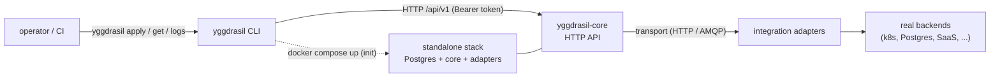

<div align="center">

# `yggdrasil`

**The official CLI for the [Yggdrasil](https://github.com/dakasa-yggdrasil/yggdrasil-core) control plane**

[](LICENSE)
[](go.mod)
[](https://github.com/dakasa-yggdrasil/yggdrasil/releases)

*One-command bootstrap · `kubectl`-style manifest ops · one-line integration installs*

[Usage](docs/USAGE.md) · [Commands](docs/COMMANDS.md) · [Configuration](docs/CONFIGURATION.md) · [Development](docs/DEVELOPMENT.md)

</div>

---

## What it is

`yggdrasil` is the terminal interface to a self-hosted
[Yggdrasil control plane](https://github.com/dakasa-yggdrasil/yggdrasil-core) —
the **self-hosted control plane for declarative workflows + integrations over
your whole stack**. Think *Backstage, but more complete and scalable*: an
orchestration engine + versioned manifest catalog + RBAC/policy + OAuth/OIDC +
a pluggable integration ecosystem. You write YAML; Yggdrasil persists, runs, and
audits it.

This CLI is the front door. It speaks the same HTTP API the web console does,
so everything you can do in the UI you can do (and script) from a terminal:
bootstrap a fresh stack, apply manifests, install integrations, run workflows,
manage collaborators, and stream a run to completion.

> **Where business logic lives.** This repo builds only the CLI binary. All
> authority — schema validation, workflow execution, RBAC — lives in
> [`yggdrasil-core`](https://github.com/dakasa-yggdrasil/yggdrasil-core). The CLI
> is intentionally thin: it shapes HTTP calls and renders responses.

## Where it fits



The CLI never talks to a backend directly. It POSTs declarative manifests to
`yggdrasil-core`, which compiles workflows and dispatches them to integration
adapters over a transport (HTTP by default, AMQP opt-in). See
[docs/USAGE.md](docs/USAGE.md) for the full walk-through.

## Commands

A `kubectl`-shaped command tree. Full flag reference in
[docs/COMMANDS.md](docs/COMMANDS.md).

| Group | Commands |
|---|---|
| **Bootstrap & connection** | `init` · `login` · `status` · `version` · `update` · `config <verb>` |
| **Manifest operations** | `apply` (incl. `--dry-run`) · `get` · `describe` · `diff` · `delete` · `rollback` |
| **Workflow runs** | `run` · `ops list\|get\|retry\|abort\|replay` · `logs` |
| **Control-plane deploy** | `deploy control-plane` |
| **Integration catalog** | `install` (GitHub & `oci://` refs) |
| **Auth providers** | `auth provider list\|get\|apply\|delete` |
| **Collaborators** | `collaborator <verb>` (lifecycle, teams, absence, audit) |
| **Scaffolding** | `new integration` · `new surface` · `new <kind>` (starter manifest YAML) |
| **Workspace dev** (contributors) | `integrations …` · `surfaces …` |

## Install

### From release (recommended)

Grab a prebuilt archive for your OS/arch from the
[latest release](https://github.com/dakasa-yggdrasil/yggdrasil/releases/latest).
Archives are named `yggdrasil_<version>_<os>_<arch>.tar.gz` (Windows ships a
`.zip`). For example:

```sh
VERSION=0.1.0      # the release you want
OS=darwin          # darwin | linux | windows  (matches goreleaser output)
ARCH=arm64         # amd64 | arm64
curl -L -o yggdrasil.tar.gz \
  "https://github.com/dakasa-yggdrasil/yggdrasil/releases/download/v${VERSION}/yggdrasil_${VERSION}_${OS}_${ARCH}.tar.gz"
tar xzf yggdrasil.tar.gz
sudo mv yggdrasil /usr/local/bin/
yggdrasil version
```

### From source

```sh
go install github.com/dakasa-yggdrasil/yggdrasil/cmd/yggdrasil@latest
```

Requires Go 1.25+. A source build reports its version as `dev` plus the VCS
revision; tagged release binaries report the real semver.

### Staying up to date

A release binary can update itself in place:

```sh
yggdrasil update          # download + verify + replace this binary
yggdrasil update --check  # just report whether a newer release exists
```

`update` pulls the latest GitHub release asset for your OS/arch, verifies its
goreleaser checksum, and atomically swaps the running binary. It needs write
access to the install dir — use `sudo yggdrasil update` if it lives in
`/usr/local/bin`. Self-update is **not yet supported on Windows** (it points you
at the releases page instead). After any command the CLI also checks GitHub at
most once a day and prints a one-line nudge to stderr when you're behind — see
[docs/COMMANDS.md](docs/COMMANDS.md#update) for details.

## Quick start

```sh
# 1. Boot a full self-hosted stack on this machine (needs Docker + compose v2).
#    Brings up Postgres + yggdrasil-core + the kubernetes and schema-migrations
#    adapters, seeds a first admin, and saves a "local" context.
yggdrasil init

# 2. Confirm everything is up.
yggdrasil status

# 3. Install an integration from a GitHub repo that ships a quickstart manifest.
yggdrasil install dakasa-yggdrasil/integration-kubernetes --provider kubernetes

# 4. Apply a workflow (or any manifest) you wrote.
yggdrasil apply -f my-workflow.yaml

# 5. Run it and stream the steps to completion (sync by default).
yggdrasil run my-workflow -n default --input target=prod
```

The full end-to-end journey — install → init → login → apply → get → run → ops/logs —
is in [docs/USAGE.md](docs/USAGE.md).

## Configuration

State lives in `~/.yggdrasil/config.yaml`, a `kubectl`-style multi-context file
written by `init` and `login`:

```yaml
current_context: local
contexts:
  local:
    server: http://localhost:9080
    token: <session-token>
    collaborator: admin
  prod:
    server: https://yggdrasil.example.com
    token: <session-token>
    collaborator: ops-bot
```

Switch context or point at a different file per-command, without editing it:

```sh
YGGDRASIL_CONTEXT=prod yggdrasil get workflow
YGGDRASIL_CONFIG=/etc/yggdrasil/ci.yaml yggdrasil apply -f workflow.yaml
```

Every field, every env var (`YGGDRASIL_CONTEXT`, `YGGDRASIL_CONFIG`,
`YGGDRASIL_URL`, `YGGDRASIL_GITHUB_TOKEN`, …) is documented in
[docs/CONFIGURATION.md](docs/CONFIGURATION.md).

## Development

```sh
go build -o yggdrasil ./cmd/yggdrasil        # build the CLI
go test ./...                                # unit tests
task arch:check                              # architecture-boundary check
goreleaser release --snapshot --clean --skip=publish   # dry-run a release
```

Repo layout, the submodule/monorepo split, CI, and the release flow are in
[docs/DEVELOPMENT.md](docs/DEVELOPMENT.md).

## Compatibility

The CLI is API-compatible with the `yggdrasil-core` minor version it ships
against. It targets the `/api/v1` surface of
[`yggdrasil-core`](https://github.com/dakasa-yggdrasil/yggdrasil-core) and the
quickstart-manifest contract of
[`integration-template`](https://github.com/dakasa-yggdrasil/integration-template).

## License

Apache 2.0 — see [LICENSE](LICENSE).

---

<div align="center">

Part of the [Yggdrasil](https://github.com/dakasa-yggdrasil/yggdrasil-core) project · [Report an issue](https://github.com/dakasa-yggdrasil/yggdrasil/issues)

</div>
