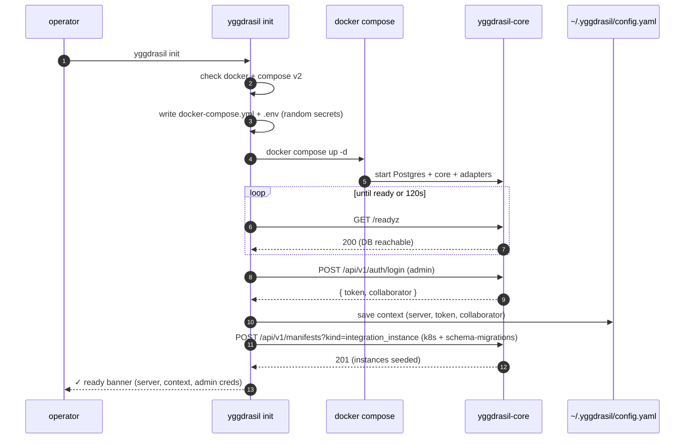

# Usage — install → init → login → apply → get → logs

A copy-pasteable walk-through that takes you from an empty machine to a running
workflow you can watch finish. Every command and flag here is verified against
the CLI source in `cmd/yggdrasil/` and `internal/`.

For the exact flag reference see [COMMANDS.md](COMMANDS.md); for config and env
vars see [CONFIGURATION.md](CONFIGURATION.md). This CLI talks to a
[`yggdrasil-core`](https://github.com/dakasa-yggdrasil/yggdrasil-core) over HTTP
and is intentionally thin — the core is authoritative.

---

## 1. Install the binary

Grab a release archive (named `yggdrasil_<version>_<os>_<arch>.tar.gz`) or build
from source:

```sh
# from source — needs Go 1.25+
go install github.com/dakasa-yggdrasil/yggdrasil/cmd/yggdrasil@latest

yggdrasil version
```

`yggdrasil version` prints `yggdrasil <version> (<short-sha>)`. A source build
reports `dev` plus the VCS revision; release binaries report the tagged semver.

---

## 2. Bootstrap a stack — `yggdrasil init`

`init` has two modes.

### Standalone (default)

Writes a `docker-compose.yml` + `.env` into a target directory, runs
`docker compose up -d`, waits for `/readyz`, logs in as the first admin, seeds
the adapter `integration_instance` manifests, and saves a CLI context.

```sh
yggdrasil init
```

Requirements: `docker` on `PATH` and the **compose v2** plugin
(`docker compose version` must succeed). The stack it brings up:

- **Postgres** (data persisted in a named volume).
- **yggdrasil-core** on host port `9080`.
- **integration-kubernetes** adapter (HTTP transport, needs a kubeconfig — it
  mounts `~/.kube/config` read-only by default).
- **integration-schema-migrations** adapter (goose-postgres).
- **RabbitMQ** is **opt-in**, not started by default — see
  [CONFIGURATION.md](CONFIGURATION.md#amqp-rabbitmq-opt-in).

Useful flags (full list in [COMMANDS.md](COMMANDS.md#init)):

```sh
yggdrasil init \
  --dir ./my-stack \                 # where compose files land (default ./yggdrasil)
  --port 9080 \                      # host port for the core
  --admin-username admin \           # first admin slug
  --admin-password 's3cret' \        # omit for a random one printed at the end
  --core-image ghcr.io/dakasa-yggdrasil/yggdrasil-core:latest \
  --context local                    # name to store in ~/.yggdrasil/config.yaml
```

When `--admin-password` is omitted, a random 24-char password is generated and
printed once in the success banner — **save it**.

### Attach to an existing core

If you already run `yggdrasil-core` (helm, kustomize, etc.), skip compose and
just log in + persist a context:

```sh
yggdrasil init --server https://yggdrasil.example.com \
  --admin-username admin --admin-password 's3cret'
```

### What `init` does, step by step



The two seeded `integration_instance` manifests
(`yggdrasil-core-kubernetes`, `yggdrasil-core-schema-migrations`, both in
namespace `global`) point at the adapter services on the compose network so
workflows like `yggdrasil-deploy-control-plane` have something to dispatch to.

---

## 3. Confirm the connection — `yggdrasil status`

```sh
yggdrasil status
```

```
config:  /Users/you/.yggdrasil/config.yaml
context: local
server:  http://localhost:9080
user:    admin
health:  ok
ready:   ok
```

`status` resolves the active context, then probes `/healthz` and `/readyz` with
a 5s timeout. If the server is down you get `health: unreachable (...)`.

---

## 4. Log in / add a context — `yggdrasil login`

`init` already logs you in. Use `login` to add another context (e.g. prod) or
refresh a token:

```sh
yggdrasil login --server https://yggdrasil.example.com --username ops-bot
# prompts for the password interactively (hidden input)
```

This calls `POST /api/v1/auth/login`, stores the returned session token under a
context (named with `--context`, or derived from the host), and makes it
current. Add `--non-interactive` in CI and pass `--password` explicitly.

---

## 5. Install an integration — `yggdrasil install`

`install` fetches a repo's `yggdrasil-quickstart.yaml`, walks you through the
declared inputs (interactive TUI by default), and POSTs the request to the
core's `/api/v1/integrations/install`.

```sh
# GitHub ref (default branch + yggdrasil-quickstart.yaml)
yggdrasil install dakasa-yggdrasil/integration-kubernetes --provider kubernetes

# pinned ref / custom manifest path
yggdrasil install dakasa-yggdrasil/integration-kubernetes@v1.2.3
yggdrasil install dakasa-yggdrasil/integration-foo:deploy/quickstart.yaml

# OCI registry ref (latest tag, or pinned)
yggdrasil install oci://ghcr.io/dakasa-yggdrasil/integration-kubernetes
yggdrasil install oci://ghcr.io/dakasa-yggdrasil/integration-kubernetes:v1.2.3
```

For CI, run headless and feed inputs with repeatable `--input k=v`:

```sh
yggdrasil install dakasa-yggdrasil/integration-kubernetes \
  --provider kubernetes \
  --non-interactive \
  --input region=us-east-1 \
  --input tier=standard
```

`--dry-run` asks the server to compile the workflow without dispatching it.
The server URL/token default to `$YGGDRASIL_URL` / `$YGGDRASIL_WORKFLOW_RUN_TOKEN`
(handy in a workflow-run context); private GitHub repos and GHCR use
`$YGGDRASIL_GITHUB_TOKEN` (falling back to `$GITHUB_TOKEN`).

---

## 6. Apply a manifest — `yggdrasil apply`

`apply` reads a YAML or JSON manifest and creates a new version of it in the
catalog. The envelope must have `kind`, `metadata`, and `spec`. Multiple
documents in one file (`---` separated) are applied in order.

```yaml
# my-workflow.yaml
apiVersion: yggdrasil.io/v1alpha1
kind: workflow
metadata:
  name: hello
  namespace: default
  description: Minimal example workflow
spec:
  steps: []
```

```sh
yggdrasil apply -f my-workflow.yaml
# created workflow default/hello (version 1)

yggdrasil apply -f - < bundle.yaml      # read from stdin
```

Under the hood the CLI POSTs to `/api/v1/manifests?kind=<kind>` — one endpoint
covers every manifest kind; the server validates the schema. `--server` /
`--token` override the active context for a one-off.

---

## 7. List & inspect — `yggdrasil get` / `describe`

```sh
yggdrasil get workflow                 # table of all workflows
yggdrasil get workflow -n default      # scope to a namespace
yggdrasil get workflow hello -o yaml   # one manifest, raw YAML
yggdrasil get workflow -o json         # machine-readable
yggdrasil get workflow --active-only   # only metadata.active == true
```

`get` defaults to a table (`KIND  NAMESPACE  NAME  VERSION  ACTIVE`). `describe`
is sugar for "fetch one manifest as full YAML" and errors if the name is
ambiguous across namespaces:

```sh
yggdrasil describe workflow hello -n default
```

---

## 8. Run & stream — `yggdrasil logs`

After a workflow run is dispatched (e.g. by `install`, `deploy`, or the core
UI), follow it by run id. `logs` polls the run endpoint and prints each step
transition until the run reaches a terminal state.

```sh
yggdrasil logs <run-id>
```

```
→ build [running] kubernetes.apply
✓ build [succeeded] kubernetes.apply
✓ migrate [succeeded] schema-migrations.up

run <run-id>: succeeded
```

Tuning flags:

```sh
yggdrasil logs <run-id> --interval 2 --timeout 600   # poll every 2s, give up after 10m
yggdrasil logs <run-id> -f=false                     # print current state once and exit
```

A `failed` run makes the command exit non-zero — friendly for CI gates.

---

## 9. Deploy the control plane — `yggdrasil deploy`

A convenience that applies a `control_plane` manifest and immediately dispatches
the seeded `yggdrasil-deploy-control-plane` workflow against it, printing
per-step progress synchronously:

```sh
yggdrasil deploy control-plane -f control-plane.yaml
yggdrasil deploy control-plane -f cp.yaml --no-run   # apply only, skip the run
```

It defaults the `kubernetes_instance` / `schema_migrations_instance` workflow
inputs to the names the standalone `init` topology seeds. Override with
`--kubernetes-instance`, `--schema-migrations-instance`, `--instance-namespace`.

---

## 10. Manage collaborators — `yggdrasil collaborator`

Drive the workforce lifecycle from the CLI (create, offboard, suspend, team
membership, absences, audit). Output is JSON, so it pipes cleanly into `jq`.

```sh
yggdrasil collaborator create --slug jdoe --display-name "J. Doe" --email jdoe@acme.com
yggdrasil collaborator list --status active
yggdrasil collaborator team-add <id> --team <team-id> --role-in-team lead
yggdrasil collaborator offboard <id> --reason voluntary --end-date 2026-07-01
yggdrasil collaborator lifecycle-events <id> --limit 50
```

See [COMMANDS.md](COMMANDS.md#collaborator) for the full verb + flag matrix.

---

## 11. Scaffold a plugin — `yggdrasil new`

```sh
yggdrasil new integration datadog --owner acme
yggdrasil new surface admin-portal --owner acme
```

This shallow-clones the official template
(`dakasa-yggdrasil/integration-template` or `surface-template`), rewrites the Go
module path + project name, strips the template's git history, and inits a fresh
repo. `go test ./...` passes out of the box. See
[DEVELOPMENT.md](DEVELOPMENT.md#scaffolding) for the rewrite rules.

---

## Where to go next

- [COMMANDS.md](COMMANDS.md) — every command, every flag.
- [CONFIGURATION.md](CONFIGURATION.md) — config file, env vars, multi-context.
- [DEVELOPMENT.md](DEVELOPMENT.md) — build, test, release, repo layout.
- [yggdrasil-core](https://github.com/dakasa-yggdrasil/yggdrasil-core) — the
  server this CLI drives.
