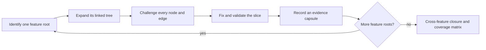

# Feature-linked deep audits

Use this procedure whenever the requested scope is a deep audit, exhaustive sweep, or production-readiness review. The unit of work is a user-visible or independently triggered feature, not a directory, layer, service, surface, or integration.

## Authority boundary

First record the authorized repository set. Discovery may expose an edge outside that set, but it does not grant permission to traverse or modify the external implementation.

For an external edge in a repository-scoped task, stop and write a Definition of Done for its owner containing:

- producer-side evidence and the expected consumer contract;
- a deterministic reproduction;
- acceptance criteria and compatibility constraints;
- required tests and runtime evidence;
- the evidence the owner must return to close the edge.

Mark that edge `blocked_external`; a handoff is not proof that it works. Cross-repository traversal is legal only when the user explicitly authorizes an aggregator or workspace scope. In an explicitly authorized `dakasa-system` audit, the repository set may include the complete DaKasa and Yggdrasil universe, but the nearest repository policies, local validation gates, and domain ownership still apply.

## 1. Build the inventory

Derive feature roots from at least two independent sources: product routes or screens; public APIs and CLIs; contracts, protobufs, events, queues, and workflows; database transitions and scheduled jobs; operational runbooks; representative tests. Give each root one status: `discovered`, `in_progress`, `completed`, `blocked`, or `not_applicable`.

## 2. Expand one linked tree

Trace every applicable branch:

| Branch | Evidence to collect |
|---|---|
| Entry | UI, API, CLI, scheduler, webhook, event, reconciliation loop |
| State | validation, authorization, flags, optimistic state, rollback |
| Contract | schema, identity, idempotency, ordering, versioning |
| Transport | HTTP/RPC, queue, stream, retry, DLQ, reconnect |
| Persistence | transaction boundary, uniqueness, race, migration, cleanup |
| Workflow | activities, compensation, cancellation, replay |
| External effect | cloud/provider call, timeout, rate limit, partial failure |
| Observability | logs, metrics, traces, audit history, actionable alerts |
| Lifecycle | creation, steady state, update, deletion, expiry, recovery |

Shared nodes receive one evidence capsule referenced by every dependent feature. If a shared node changes, reopen those dependents.

## 3. Challenge every edge

For each edge, prove the happy path and challenge malformed input, duplicate delivery, retry, reordering, concurrency, permission boundaries, stale state, partial failure, cancellation, cleanup, and observability. A passing node does not prove a passing feature; the handoff between nodes must also be verified.

## 4. Fix and validate the slice

Apply authorized fixes while the feature context is small. Add the narrowest regression test that would have caught each defect, then run focused checks and the repository's aggregate gates. Update contracts and documentation in the same slice. Do not weaken a contract to describe a bug.

## 5. Close the feature

Record a compact capsule with the feature root, nodes, edges, invariants, evidence, fixes, exact validation, residual risks, shared dependencies, and external DoD handoffs. Mark the feature `completed` or `blocked`, then discard detailed exploratory context before starting the next root.

## Completion contract

A broad audit is complete only when the final coverage matrix reports every discovered feature root, every edge result, validation evidence, authorized fixes, and all blocked or skipped nodes with reasons. Repository discovery, route counts, mock-only tests, or truncated command output are never sufficient evidence for claims such as “all services” or “everything.”
